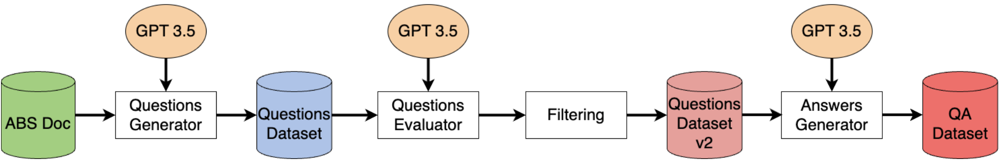

# Instruction-FineTuning

This repository contains all the code and information to perform the instruction Fine-Tuning of Mistral 7B model. 
The goal is to train a model capable of correctly handling data in a RAG scenario. Without Fine-Tuning, a general-purpose LLM, 
is not capable of correctly answering questions given the context retrieved from a vector store 
(e.g. ElasticSearch). Moreover, the Fine-Tuning pipeline aims to teach the model the correct format and language for the
answers.


The entire Fine-Tuning process can be divided into $4$ steps:

1. **Questions generation**: we generated a dataset of question using state-of-the-art models (GPT $3.5$ )
2. **Questions evaluation**: we evaluate the question dataset created in the previous step to have an idea of the overall
   quality and to discard the harmful questions
3. **Answer generation**: based on the dataset filtered in the previous step, we use SOTA models to generate the answers
4. **Fine-Tuning**: we perform the actual Fine-Tuning on the generated dataset



## Environment configuration
 
The entire code is based on Python $3.10.12$. To create a Python environment run the following commands

```bash
python3 -m virtualenv environment_name
source environment_name/bin/activate
pip3 install -f requirements.txt
```

Moreover, you need to set properly the environment variables in ``.env`` file. Specifically, you must set up the model 
you want to use during the generation process. First set ``MODEL_NAME``: the possible values are ``gpt-35``, if you want
to use GPT $3.5$ model, and ``vllm`` if you prefer a local deployment of an open-source LLM.

Other important parameters are the ones related to ElasticSearch (used during the generation of the answers) and the parameters 
of the PostgreSQL DB used to retrieve the names of the machines. Finally, you can choose to set the parameters related 
to the HuggingFace repository where the datasets will be saved.

## Data Generation Pipeline

This section explains the generation pipeline with some details about the code. More details should be found in the
scripts.

### Questions generation

The class used for the question generation is ``QuestionsGenerator`` in the file ``QAGeneration/QuestionsGenerator``. 
Essentially, it takes as input the folder of the parsed documents (in ``.json`` format, one ``JSON`` object for each page), 
the path of the last checkpoint (if present) and the folder where the questions will be saved.

To run the pipeline script, after the creation of the object, call the function ``generate_questions`` with the number of 
consecutive pages to include in the prompt of the LLM and the topics of the questions. Below is an example:

```python
from QAGeneration.QuestionsGenerator import QuestionsGenerator
from dotenv import load_dotenv
load_dotenv()
q_gen = QuestionsGenerator(input_path='parsed_docs/', output_path='data/questions')
q_gen.generate_questions(input_pages=2, topics='uso e manutenzione')
```

The questions are saved in a HuggingFace dataset with columns:

- **question**: contains the generated questions
- **first_page**: contains the first pages of the prompt used to generate the questions
- **document**: document name 
- **input_pages**: number of pages in the prompt
- **machine_code**: specific code of the machine 
- **chunks**: text passed as input in the prompt

### Questions evaluation

The class used for the question generation is ``QuestionsEvaluator`` in the file ``QAGeneration/QuestionsEvaluator``. 
This class takes as input the folder where the generated questions are saved and the path where you want to save the 
dataset with questions and scores. The score assigned by an LLM (the one selected in the ``.env``) are:

- **Relevance**: how much the question is relevant given the input document
- **Global relevance**: how much the question is relevant given the general scenario where the model should operate (in our case a virtual assistant in a manufacturing plant)
- **Coverage**: the level to which the information in the document is useful to answer the question

After the creation of the object, call the function ``evaluate``. Below is an example:

```python
from dotenv import load_dotenv
load_dotenv()
from QAGeneration.QuestionsEvaluator import QuestionsEvaluator
questions_evaluator = QuestionsEvaluator(input_path='data/questions/final/', output_path='data/questions_evaluation')
questions_evaluator.evaluate()
```

The results are saved in a HuggingFace dataset with the following columns:

- Same columns as in the Questions generation part
- relevance, global_relevance, coverage

### Answers generation

The class used for the question generation is ``AnswerGeneration`` in the file ``QAGeneration/AnswerGeneration``. The 
class takes as input the path of the questions dataset, the path where the output dataset will be saved, the path of the 
parsed documents (in this case the documents must be saved in Markdown format, with the extension ``.md``). Moreover, you 
there is a parameter called ``data_ingestion``: if it is set to ``True`` the data are injected in ElasticSearch, otherwise
the data already present in ElasticSearch will be used. 

```python
from dotenv import load_dotenv
load_dotenv()
from QAGeneration.AnswersGenerator import AnswersGenerator
answer_generator = AnswersGenerator(questions_path='data/questions_evaluation/final/', 
                                    last_checkpoint=None, output_path='data/answers/', 
                                    data_ingestion=True)
answer_generator.generate()
```

The results are saved in a HuggingFace dataset composed of the following columns:

- **system**: system prompt given in input to the generator LLM
- **question**
- **context**: context from which the question is generated 
- **answer**: answer given by the generator model
- **chunks_rag**: chunks retrieved from the RAG system

### Pipeline

To simplify the execution, we implemented a class called ``QAGenerator`` (in the file ``QAGeneration/QAGenerator``).
For the input of the class, please, take a look at the doc string directly inside the file. 

An example of how to use the class is in the script ``testing_QAGenerator.py``

## Fine-Tuning

The data generated using the pipeline introduced in the previous step are used to perform the actual fine-tuning of an
open-source LLM. In our scenario, we perform the training on 
[mistralai/Mistral-7B-v0.3](https://huggingface.co/mistralai/Mistral-7B-v0.3) publicly available on HuggingFace. To 
reduce the time and computational resources required to perform the complete Fine-Tuning of the model, we decided to 
use QLoRa, a Parameter-Efficient Fine-Tuning technique. Specifically, we use the quantized version ($4$ bits) of Mistral
model and we add LoRa layer with different parameters. Fine-Tuning is demanded for the script
``instruction_finetuning.py`` and it can be launched (with [DeepSpeed](https://github.com/microsoft/DeepSpeed)  to 
enable multi-GPU training) from the script ``run_finetuning.sh``. The precise steps required for the training process 
are explained inside the script.

## Generation of Answers

The class used for the question generation is ``ModelEvaluation`` in the file ``QAGeneration/ModelEvaluation`` generate
the answers given the input prompt used for the Fine-Tuning of the model. The main difference between the answer generation
pipeline and this evaluation class is related to the input passed to the LLM: Since this class is devoted to evaluating the 
Fine-Tuned model, takes as input the same type of prompt as in the Fine-Tuning pipeline with also the noisy chunks. 
Moreover, this class saves in a HuggingFace dataset both the reference answer (the one generated by the most capable LLM) and 
the answer given by the model we wanted to test. More precisely, the HuggingFace dataset contains the following columns:

- ``system``: system prompt used to generate the answer
- ``user``: user prompt used to generate the answer
- ``answer``: answer generated by the model we want to test
- ``reference_answer``: answer generated by "reference" model

A simple code to launch the generation is provided in the file ``run_evaluation.py``.

## Credits 
Filippo Olivo ([filippo@filippoolivo.com](mailto:filipp@filippoolivo.com)), Samuele Davenia ([davesam00@gmail.com](mailto:davesam00@gmail.com))

